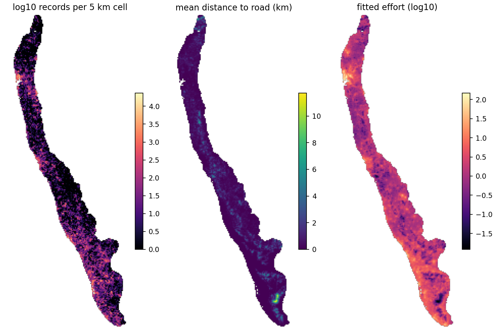
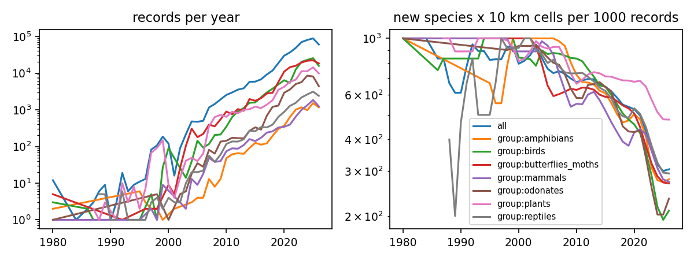
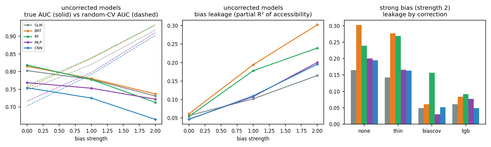
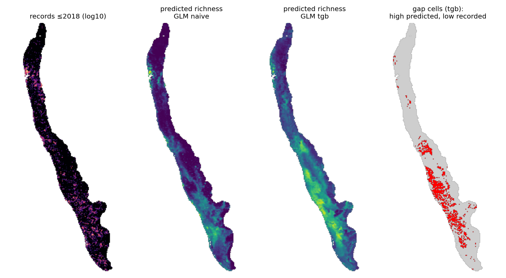

# Mid-evaluation: Can AI identify biodiversity patterns missing from conventional sampling?

EVST Project, Topic 11 · Ponnambalam V, Nandini C, Mohit Nallagatla, Manali Gupta · October 2026

> Status: about 55% of the planned work. Sections marked **[pending]** fill in as runs finish.
> Every number here is regenerated by a script in `experiments/`.

---

## 1. Problem statement

Biodiversity maps are built from occurrence records, and records are collected where people go:
near roads and towns, and in places with active observers. A model trained on such records can
learn *where observers are* and present it as *where species are*. The topic asks whether
environmentally predicted patterns reveal important, under-observed areas **after accounting for
sampling bias**.

That question breaks into five testable claims, which structure the project:

| | Hypothesis | Why it matters for the question | Test |
|---|---|---|---|
| H1 | Sampling bias in our region is strong and measurable, per data source | Before interpreting any map we need the bias as a number, not a caveat | E01 |
| H2 | Higher-capacity models (BRT, MLP, CNN) absorb more of the bias than simple ones | "AI" is not automatically more truthful; it may learn the roads better | E03 |
| H3 | Standard evaluation hides the damage and chooses the wrong model | If the usual check fails, a good score is no evidence of discovery | E02, E03 |
| H4 | Bias corrections can be ranked where truth is known | We need a defensible correction before mapping gaps | E02, E03 |
| H5 | Corrected high-suitability, low-effort cells are real gaps (new records appear there later) | This is the direct answer to the research question | E04 (preview) |

The literature review found that no reviewed study tests a deep distribution model under a
*measured* accessibility bias with honest validation. This project does that, on four test beds
that each answer a different objection.

## 2. Data used

| Test bed | Data | Role | Truth available |
|---|---|---|---|
| **T1 Virtual species** | Simulated on real Western Ghats covariates, sampled through the observer-effort surface fitted in E01 | Controlled experiment (Inman et al. 2021 design) | Known by construction |
| **T2 disdat / NCEAS** (Elith et al. 2020) | 226 species, 6 regions (Australia, Canada, NZ, South America, Switzerland); presence-only training data | The data behind Elith 2006 and Phillips 2009, so a direct reproduction | **Independent presence/absence surveys** |
| **T3 GeoLifeCLEF 2024** | Europe flora: 5M presence-only records + ~90k presence/absence surveys | Real-data test of the CNN (phase B) | Presence/absence surveys |
| **T4 Western Ghats** | GBIF occurrences, plus the project's datasets: WorldClim 2.1 (30″), ESA WorldCover 2021 (10 m → 1 km class fractions), WorldPop 2020, OpenStreetMap (roads, places, rivers, protected areas) | Answering the research question | Later records (forward-in-time test) |

**Study region.** The five RESOLVE-2017 ecoregions forming the Western Ghats and the Malabar coast,
buffered by 10 km: 181,347 km² on a 1 km UTM-43N grid (180,299 cells with complete covariates).

**Occurrence data.** GBIF monthly snapshot (2026-10-01, AWS open data). It is cleaned with
CoordinateCleaner-style filters: species-level identification; coordinate uncertainty ≤ 5 km;
≥ 2 decimal places; institution and centroid hotspots removed; clipped to the polygon.

For the mid-evaluation the occurrence data are the **iNaturalist open-data export** (all licences,
research grade): 857,561 records in the bounding box, of which 493,227 survive cleaning inside the
region. The cleaning log is `results/E01_cleaning_log.csv`; most losses are coordinate uncertainty
above 5 km (86k) and records outside the polygon (276k).

GBIF's eBird and museum-specimen records are not yet included. The public GBIF snapshot proved too
slow to extract over this connection, and a GBIF download (with DOI) is pending.

## 3. Methodology

**Bias measurement (E01).**
- Hughes et al. (2021) statistics: the share of records near roads, *compared with the share of
  land near roads*, the null they did not report.
- Oliver et al. (2021) sampling effectiveness: new species × 10 km cells per 1,000 records, by year.
- A Python port of **sampbias** (Zizka et al. 2021), where records per cell are Poisson with rate
  λ = q·exp(−Σⱼ wⱼ dⱼ) over distances to roads, towns, cities, rivers and protected areas. Fitted per
  data source and checked against the original R package.
- An observer-effort surface (negative-binomial GLM on accessibility layers) that feeds T1 and the
  corrections.

**Models (capacity ladder).** GLM (quadratic) → MaxEnt → boosted trees (BRT) → down-sampled random
forest → MLP → patch CNN. The CNN sees a 9×9 km window of the covariate stack, following Deneu et
al. 2021's spatial-context idea. GPU models are trained for all species at once with grouped,
independent weights (`models/batched.py`). Profiling showed per-step launch overhead dominated on
this laptop: one species took about 100 ms per step under load, while 15 species batched together
took about 29 ms per step.

**Corrections.**
- None (random background).
- Target-group background (Phillips et al. 2009).
- Bias-covariate conditioning: accessibility layers are model inputs, then fixed to their median
  when predicting.

**Evaluation regimes** (the core of H3):
1. Random 5-fold CV: held-out presences vs random background. This is the common default.
2. Spatial-block CV: block size from the covariate variogram range, following blockCV (Valavi et
   al. 2019) and Ploton et al. (2020).
3. Spatial CV vs held-out *target-group* sites, which uses no survey data.
4. **Truth:** independent presence/absence (T2), the known surface (T1), or later records (T4).

**Bias-leakage index (new).** The partial R² of logit(prediction) on accessibility layers, beyond
the true suitability. It is the share of the predicted map that encodes *where people go*.

## 4. Results

### 4.1 disdat: random CV picks the wrong model (E02)
226 species, 6 regions, 4 algorithms (GLM, MaxEnt, BRT, down-sampled RF). Each model is fitted with
a random background and with a target-group background (TGB), and scored four ways.

**Reproduction.**
- Against the independent surveys, TGB improves every algorithm: GLM +0.012, BRT +0.025, RF +0.024,
  MaxEnt +0.030 mean AUC.
- The gain is largest where bias is strongest: CAN +0.11, AWT +0.03, SWI +0.03; it is neutral in NZ
  and SA. This matches Phillips et al. (2009) on the same data.
- Down-sampled RF is the best uncorrected algorithm (0.731), as in Valavi et al. (2022).
  **[pending: check against their published per-model numbers]**

**Selection reversal (896 species × algorithm pairs):**

| Regime | says the TGB correction helps | agrees with truth on which is better | rank corr. of ΔAUC with truth |
|---|---|---|---|
| Independent PA (truth) | 62% (mean +0.023 AUC, Wilcoxon p = 3e-16) | – | – |
| Random CV | **4.5%** | 38% | **−0.17** |
| Spatial-block CV | 14% | 41% | −0.19 |
| Spatial CV vs target-group sites | 71% | **62%** | **+0.34** |

**Optimism of internal evaluation, uncorrected models (internal AUC minus PA AUC):**

| Region | AWT | CAN | NSW | NZ | SA | SWI |
|---|---|---|---|---|---|---|
| random CV | +0.16 | +0.33 | +0.13 | +0.10 | +0.02 | +0.13 |
| spatial-block CV | +0.08 | +0.21 | +0.08 | +0.01 | −0.11 | +0.10 |

**Block-size sensitivity.** Our own variogram ranges disagreed with the R blockCV package, so we
re-ran spatial CV for GLM and BRT using blockCV's ranges at ×0.5, ×1 and ×2. The blocks are capped
at one-fifth of the extent; at ×1 they match the main run in 5 of 6 regions.

| Block size | spatial CV says TGB helps | agrees with truth | rank corr. | optimism (uncorrected) | target-group regime rank corr. |
|---|---|---|---|---|---|
| ×0.5 | 12% | 44% | −0.13 | +0.076 | +0.37 |
| ×1 | 16% | 43% | −0.18 | +0.047 | +0.28 |
| ×2 | 18% | 43% | −0.11 | +0.018 | +0.20 |

Larger blocks shrink the *optimism* (Ploton's effect) but never fix *which model is chosen*.

### 4.2 Western Ghats bias anatomy (E01)
**Data.** 493,227 cleaned, research-grade iNaturalist records of 10,219 species inside the region.
Butterflies and moths 147k, birds 130k, plants 79k, odonates 43k, reptiles 17k, mammals 8.7k,
amphibians 8.1k. They come from the iNaturalist open-data export (1.81M observations in the bounding
box before cleaning).

**Roads (Hughes et al. 2021, with the land-area null they omitted).** 99.4% of records lie within
2.5 km of a road, but so does 94.9% of the land, so that statistic says little here. Intensity per
km² shows the bias clearly:

| Distance from road | 0–100 m | 100–250 m | 250–500 m | 0.5–1 km | 1–2 km | 2–5 km |
|---|---|---|---|---|---|---|
| share of land | 19% | 30% | 14% | 17% | 12% | 7% |
| share of records | **65%** | 25% | 5% | 2.7% | 1.6% | 0.7% |
| intensity vs uniform | **3.4×** | 0.8× | 0.35× | 0.16× | 0.14× | **0.10×** |

Land within 100 m of a road is recorded about **34 times** more intensely per km² than land 2–5 km away.

**Coverage.**
- 66.7% of 5 km cells and 14.4% of 1 km cells hold any record.
- Amphibians reach only 18.9% and 1.4% of cells respectively.
- The top 1% of species account for 30% of records.

**Coverage vs effectiveness (Oliver et al. 2021).** Records per year rose **61-fold** (1,442 in 2008
to 88,636 in 2025). New species × 10 km cell combinations per 1,000 records fell **56%** (689 to 306).
More data is not becoming proportionally more knowledge.

**sampbias (per-km decay weight w; larger means records fall off faster with distance):**

| | road (any) | major road | town | city | river | protected area |
|---|---|---|---|---|---|---|
| all | 0.47 | 0.17 | 0.05 | 0.03 | 0.11 | 0.03 |
| birds | 0.63 | 0.20 | 0.06 | 0.03 | 0.12 | 0.02 |
| butterflies & moths | 0.42 | 0.16 | 0.06 | 0.03 | 0.14 | 0.04 |
| odonates | 0.56 | 0.20 | 0.06 | 0.02 | 0.07 | 0.03 |
| plants | 0.50 | 0.08 | 0.04 | 0.03 | 0.08 | 0.03 |
| reptiles | 0.25 | 0.15 | 0.02 | 0.01 | 0.10 | 0.05 |
| amphibians | 0.26 | **0.35** | 0.03 | 0.01 | 0.12 | 0.05 |
| mammals | 0.67 | 0.01 | 0.03 | 0.01 | 0.06 | **0.08** |

Bias is taxon-specific:
- Amphibian records follow *major* roads most strongly.
- Mammal records are the most protected-area-driven.
- Herp records are the least tied to minor roads.

Caveat: iNaturalist obscures the coordinates of threatened species. Many Western Ghats herps are
threatened, which can push their points away from roads artificially.
**Cross-check against the R sampbias package.** We ran the package's own MCMC (100k iterations) on
our exact 5 km grid. All six of our Python estimates fall inside its 95% credible intervals.
Town, city, river and protected area agree within about 1%. The two road layers are collinear, so the
split between them is uncertain (major road: R 0.107 [0.008, 0.170] vs Python 0.167), but their sum
agrees (0.668 vs 0.641). Results are in `results/R_sampbias_vs_python.csv`.
### 4.3 Virtual species: capacity vs leakage (E03)
**Setup.**
- 30 virtual species on the real Western Ghats covariates. Each has a Gaussian niche on climate,
  elevation and natural land cover, with prevalence between 5% and 35%.
- 300 records per species, sampled through the fitted observer-effort surface raised to a bias
  strength of 0 (unbiased), 1 (as biased as real iNaturalist records) or 2 (exaggerated).
- 4 corrections × 5 models. Truth is a presence/absence realisation over 20,000 random cells.

**1. Skill and its check move in opposite directions.** Uncorrected models, from no bias to strong bias:

| | GLM | BRT | RF | MLP | CNN |
|---|---|---|---|---|---|
| true AUC, strength 0 → 2 | 0.80 → 0.73 | 0.82 → 0.74 | 0.82 → 0.71 | 0.77 → 0.72 | 0.75 → 0.67 |
| random-CV AUC, strength 0 → 2 | 0.75 → 0.92 | 0.76 → 0.93 | 0.76 → 0.93 | 0.72 → 0.91 | 0.70 → 0.90 |

**2. Flexible models absorb more bias, but trees, not neural networks, absorb the most.** Excess
leakage at strength 2 (leakage minus the unbiased baseline):

| GLM | CNN | MLP | RF | BRT |
|---|---|---|---|---|
| 0.11 | 0.15 | 0.15 | 0.19 | **0.24** |

Every flexible model leaks significantly more than GLM (paired Wilcoxon p ≤ 0.003). H2 holds in the
form "flexible > linear", not "deeper > shallower".

**The CNN** had the lowest true AUC at every bias level. This is partly by design: these virtual
species respond to point values only, so spatial context cannot help and adds variance. The
GeoLifeCLEF test (phase B) is the fair test of the CNN.

**3. Corrections at strength 2 (mean true AUC across models; leakage range):**

| none | geographic thinning | bias-covariate conditioning | target-group background |
|---|---|---|---|
| 0.714 (0.17–0.30) | 0.709 (0.14–0.28) | 0.723 (0.03–0.16) | **0.757** (0.05–0.09) |

- **TGB is the truly best correction** for 77–90% of species with GLM, BRT, RF and CNN (60% with MLP).
- **Thinning barely helps,** consistent with Inman et al. 2021 (background weighting beats geographic
  filtering).
- **Bias-covariate conditioning fails for RF** (leakage 0.16): forests do not "switch off" a
  covariate cleanly.

**4. Random CV picks the wrong correction, in a specific way.** At strength 2, random CV picks
**bias-covariate conditioning for 83–97% of species**, because that model uses accessibility
explicitly and the biased held-out records reward it. The truth picks TGB for most species. Random
CV chooses the truly best correction for only 0–33% of species. In short, *it rewards the method that
models the bias best, not the one that removes it.*
### 4.4 Western Ghats gap map and forward-in-time test (E04)
**Setup.**
- 435 species with at least 20 occupied 1 km cells in records up to 2018: birds 190,
  butterflies and moths 166, odonates 36, reptiles 22, mammals 12, amphibians 9.
- GLM and BRT on environmental layers only, each with a random background (naive) and a
  target-group background (TGB).
- The 2019–2026 records act as the independent test.

**1. Correction changes the map, not just the scores.**
- The naive richness map peaks near Mumbai–Pune and the coast, where records are densest.
- The TGB map peaks in the wet evergreen forests of the central and southern Ghats.
- The correlation between predicted richness and the number of pre-2019 records falls from 0.41 to
  0.13 (GLM) and from 0.62 to 0.33 (BRT): the uncorrected map is largely a map of observers.

**2. Species-level forward test.**
- Cells where a species was *newly* recorded in 2019–2026 are ranked above cells surveyed for its
  group but where it wasn't found, at discovery AUC **0.67–0.68**.
- TGB does **not** improve this: BRT −0.001 (p = 0.34), GLM −0.006.

**3. Do gap cells hold undiscovered records? Not beyond effort.**
- Cells flagged as gaps (top-quartile predicted richness, bottom-quartile records) did yield 1.6–1.7×
  more new species × cell detections per later record than other cells.
- But that is a saturation effect: *any* under-sampled cell yields more novelty per visit.
- Among equally under-sampled cells that were revisited, predicted richness had **no effect** on
  discoveries once later effort is controlled for (negative-binomial β = +0.005 to +0.008 per SD,
  95% CI about ±0.03, for all four model × correction combinations).

**Reading.** At this stage H5 is *not* supported. Over 2019–2026, where new records appear is
explained by where observers went next, not by where models predict richness.

Reasons to test in phase B:
- **Species set.** The test covers common species (≥ 20 cells), not the rare endemics a
  "hidden biodiversity" claim concerns.
- **Later effort is still road-bound.**
- **Dense roads.** Half of all 1 km cells contain a road, so environmental space is already well
  covered. This mirrors disdat, where TGB gained nothing in the low-bias regions.

## 5. Observations so far
1. Against independent truth, target-group background improves models (reproducing Phillips 2009).
   Yet **random cross-validation recommends the uncorrected model in nearly every case**, and its
   verdict is anti-correlated with the truth. Internal skill is inflated by 0.16–0.33 AUC.
2. **Spatial blocking does not fix this.** Ploton/Valavi blocking removes autocorrelation optimism,
   but the held-out presences carry the same observer bias as the training presences, so blocked
   CV still rewards bias. This is a distinct failure from the one Ploton et al. describe.
3. A practical fix needs no survey data: score held-out presences against held-out
   **target-group** sites. It agrees with the independent truth about twice as often as random CV.
4. In simulation, every flexible model absorbs more bias than a GLM, and boosted trees absorb the
   most (not the CNN). Target-group background is the most reliable correction. Random CV
   systematically picks bias-covariate conditioning, the correction that best *models* the bias, over
   the one that best *removes* it.
5. In the Western Ghats, records are about 34× denser per km² within 100 m of a road than 2–5 km
   away. Recording volume rose 61-fold since 2008 while new knowledge per record fell 56%.
   Correcting for bias moves predicted richness from cities and coast into the evergreen Ghats.
   But the 2019–2026 records do not yet confirm that corrected maps predict *where new records
   appear* beyond observer effort. That is an honest negative result for H5 at this stage.
6. Corrections to our literature review, from reading the full texts:
   - Deneu et al. 2021 *do* address observer bias implicitly (a softmax over species given an
     observation, akin to target-group logic), but validate with a random split.
   - Elith et al. 2006 diagnosed bias; they did not ignore it.

## 6. Limitations (so far)
- The OSM road network is itself incomplete in rural areas, which can exaggerate apparent
  under-sampling. This will be quantified with GRIP4 roads in phase B.
- WorldClim is interpolated from a sparse station network, so covariate quality is lowest in the
  least-sampled areas.
- The CC-BY-NC exclusion in the AWS snapshot (see Data).
- eBird checklist effort (Johnston et al. 2021) is not used, because EBD access is pending.

## 7. Plan to final evaluation
- E05: Fithian et al. multispecies PO+PA reproduction (R `multispeciesPP`).
- E06: GeoLifeCLEF CNN on real presence/absence data.
- E07: adversarial debiasing of the CNN.
- E08: full forward validation, adding:
  - endemic and rare-species subsets;
  - the test restricted to cells more than 1 km from roads;
  - eBird and specimen data once the GBIF download is available.
- E09: OSM vs GRIP circularity.
- E10: robustness to block size, taxa and resolution.
