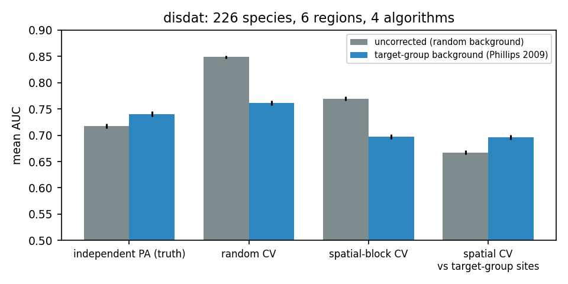
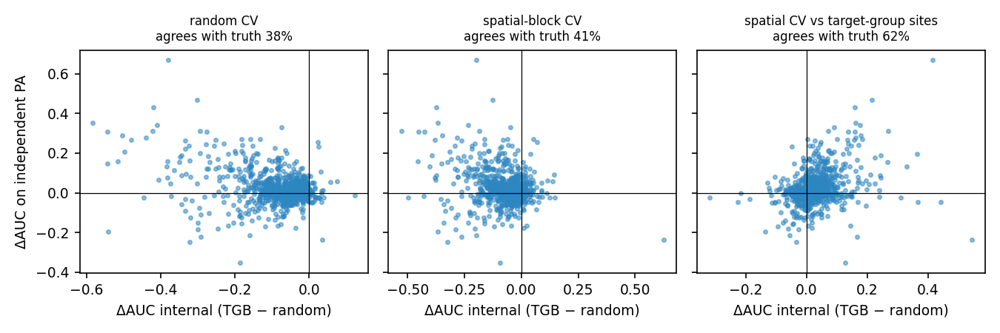

# Mid-evaluation: Can AI identify biodiversity patterns missing from conventional sampling?

EVST Project, Topic 11 · Ponnambalam V, Nandini C, Mohit Nallagatla, Manali Gupta · October 2026

> Status: about 55% of the planned work. Sections marked **[pending]** fill in as runs finish.
> Every number here is regenerated by a script in `experiments/`.

---

## 1. Problem statement

Biodiversity maps are built from occurrence records, and records are collected where people go:
near roads and towns, and in places with active observers. A model trained on such records can
learn *where observers are* and present it as *where species are*. The topic asks whether
environmentally predicted patterns reveal important, under-observed areas **after accounting for
sampling bias**.

That question breaks into five testable claims, which structure the project:

| | Hypothesis | Why it matters for the question | Test |
|---|---|---|---|
| H1 | Sampling bias in our region is strong and measurable, per data source | Before interpreting any map we need the bias as a number, not a caveat | E01 |
| H2 | Higher-capacity models (BRT, MLP, CNN) absorb more of the bias than simple ones | "AI" is not automatically more truthful; it may learn the roads better | E03 |
| H3 | Standard evaluation hides the damage and chooses the wrong model | If the usual check fails, a good score is no evidence of discovery | E02, E03 |
| H4 | Bias corrections can be ranked where truth is known | We need a defensible correction before mapping gaps | E02, E03 |
| H5 | Corrected high-suitability, low-effort cells are real gaps (new records appear there later) | This is the direct answer to the research question | E04 (preview) |

The literature review found that no reviewed study tests a deep distribution model under a
*measured* accessibility bias with honest validation. This project does that, on four test beds
that each answer a different objection.

## 2. Data used

| Test bed | Data | Role | Truth available |
|---|---|---|---|
| **T1 Virtual species** | Simulated on real Western Ghats covariates, sampled through the observer-effort surface fitted in E01 | Controlled experiment (Inman et al. 2021 design) | Known by construction |
| **T2 disdat / NCEAS** (Elith et al. 2020) | 226 species, 6 regions (Australia, Canada, NZ, South America, Switzerland); presence-only training data | The data behind Elith 2006 and Phillips 2009, so a direct reproduction | **Independent presence/absence surveys** |
| **T3 GeoLifeCLEF 2024** | Europe flora: 5M presence-only records + ~90k presence/absence surveys | Real-data test of the CNN (phase B) | Presence/absence surveys |
| **T4 Western Ghats** | GBIF occurrences, plus the project's datasets: WorldClim 2.1 (30″), ESA WorldCover 2021 (10 m → 1 km class fractions), WorldPop 2020, OpenStreetMap (roads, places, rivers, protected areas) | Answering the research question | Later records (forward-in-time test) |

**Study region.** The five RESOLVE-2017 ecoregions forming the Western Ghats and the Malabar coast,
buffered by 10 km: 181,347 km² on a 1 km UTM-43N grid (180,299 cells with complete covariates).

**Occurrence data.** GBIF monthly snapshot (2026-10-01, AWS open data). It is cleaned with
CoordinateCleaner-style filters: species-level identification; coordinate uncertainty ≤ 5 km;
≥ 2 decimal places; institution and centroid hotspots removed; clipped to the polygon.
**[pending: record counts by source and taxon]**
Caveat: the AWS snapshot carries only CC0/CC-BY records, so CC-BY-NC iNaturalist records are absent.
A citable GBIF download (DOI) will replace it for the final report.

## 3. Methodology

**Bias measurement (E01).**
- Hughes et al. (2021) statistics: the share of records near roads, *compared with the share of
  land near roads*, the null they did not report.
- Oliver et al. (2021) sampling effectiveness: new species × 10 km cells per 1,000 records, by year.
- A Python port of **sampbias** (Zizka et al. 2021), where records per cell are Poisson with rate
  λ = q·exp(−Σⱼ wⱼ dⱼ) over distances to roads, towns, cities, rivers and protected areas. Fitted per
  data source and checked against the original R package.
- An observer-effort surface (negative-binomial GLM on accessibility layers) that feeds T1 and the
  corrections.

**Models (capacity ladder).** GLM (quadratic) → MaxEnt → boosted trees (BRT) → down-sampled random
forest → MLP → patch CNN. The CNN sees a 9×9 km window of the covariate stack, following Deneu et
al. 2021's spatial-context idea. GPU models are trained for all species at once with grouped,
independent weights (`models/batched.py`). Profiling showed per-step launch overhead dominated on
this laptop: one species took about 100 ms per step under load, while 15 species batched together
took about 29 ms per step.

**Corrections.**
- None (random background).
- Target-group background (Phillips et al. 2009).
- Bias-covariate conditioning: accessibility layers are model inputs, then fixed to their median
  when predicting.

**Evaluation regimes** (the core of H3):
1. Random 5-fold CV: held-out presences vs random background. This is the common default.
2. Spatial-block CV: block size from the covariate variogram range, following blockCV (Valavi et
   al. 2019) and Ploton et al. (2020).
3. Spatial CV vs held-out *target-group* sites, which uses no survey data.
4. **Truth:** independent presence/absence (T2), the known surface (T1), or later records (T4).

**Bias-leakage index (new).** The partial R² of logit(prediction) on accessibility layers, beyond
the true suitability. It is the share of the predicted map that encodes *where people go*.

## 4. Results

### 4.1 disdat: random CV picks the wrong model (E02)
226 species, 6 regions, 4 algorithms (GLM, MaxEnt, BRT, down-sampled RF). Each model is fitted with
a random background and with a target-group background (TGB), and scored four ways.

**Reproduction.**
- Against the independent surveys, TGB improves every algorithm: GLM +0.012, BRT +0.025, RF +0.024,
  MaxEnt +0.030 mean AUC.
- The gain is largest where bias is strongest: CAN +0.11, AWT +0.03, SWI +0.03; it is neutral in NZ
  and SA. This matches Phillips et al. (2009) on the same data.
- Down-sampled RF is the best uncorrected algorithm (0.731), as in Valavi et al. (2022).
  **[pending: check against their published per-model numbers]**

**Selection reversal (896 species × algorithm pairs):**

| Regime | says the TGB correction helps | agrees with truth on which is better | rank corr. of ΔAUC with truth |
|---|---|---|---|
| Independent PA (truth) | 62% (mean +0.023 AUC, Wilcoxon p = 3e-16) | – | – |
| Random CV | **4.5%** | 38% | **−0.17** |
| Spatial-block CV | 14% | 41% | −0.19 |
| Spatial CV vs target-group sites | 71% | **62%** | **+0.34** |

**Optimism of internal evaluation, uncorrected models (internal AUC minus PA AUC):**

| Region | AWT | CAN | NSW | NZ | SA | SWI |
|---|---|---|---|---|---|---|
| random CV | +0.16 | +0.33 | +0.13 | +0.10 | +0.02 | +0.13 |
| spatial-block CV | +0.08 | +0.21 | +0.08 | +0.01 | −0.11 | +0.10 |

**Block-size sensitivity.** Our own variogram ranges disagreed with the R blockCV package, so we
re-ran spatial CV for GLM and BRT using blockCV's ranges at ×0.5, ×1 and ×2. The blocks are capped
at one-fifth of the extent; at ×1 they match the main run in 5 of 6 regions.

| Block size | spatial CV says TGB helps | agrees with truth | rank corr. | optimism (uncorrected) | target-group regime rank corr. |
|---|---|---|---|---|---|
| ×0.5 | 12% | 44% | −0.13 | +0.076 | +0.37 |
| ×1 | 16% | 43% | −0.18 | +0.047 | +0.28 |
| ×2 | 18% | 43% | −0.11 | +0.018 | +0.20 |

Larger blocks shrink the *optimism* (Ploton's effect) but never fix *which model is chosen*.

### 4.2 Western Ghats bias anatomy (E01)  **[pending]**
### 4.3 Virtual species: capacity vs leakage (E03)  **[pending]**
### 4.4 First gap map and forward test (E04)  **[pending]**

## 5. Observations so far
1. Against independent truth, target-group background improves models (reproducing Phillips 2009).
   Yet **random cross-validation recommends the uncorrected model in nearly every case**, and its
   verdict is anti-correlated with the truth. Internal skill is inflated by 0.16–0.33 AUC.
2. **Spatial blocking does not fix this.** Ploton/Valavi blocking removes autocorrelation optimism,
   but the held-out presences carry the same observer bias as the training presences, so blocked
   CV still rewards bias. This is a distinct failure from the one Ploton et al. describe.
3. A practical fix needs no survey data: score held-out presences against held-out
   **target-group** sites. It agrees with the independent truth about twice as often as random CV.
4. Corrections to our literature review, from reading the full texts:
   - Deneu et al. 2021 *do* address observer bias implicitly (a softmax over species given an
     observation, akin to target-group logic), but validate with a random split.
   - Elith et al. 2006 diagnosed bias; they did not ignore it.

## 6. Limitations (so far)
- The OSM road network is itself incomplete in rural areas, which can exaggerate apparent
  under-sampling. This will be quantified with GRIP4 roads in phase B.
- WorldClim is interpolated from a sparse station network, so covariate quality is lowest in the
  least-sampled areas.
- The CC-BY-NC exclusion in the AWS snapshot (see Data).
- eBird checklist effort (Johnston et al. 2021) is not used, because EBD access is pending.

## 7. Plan to final evaluation
- E05: Fithian et al. multispecies PO+PA reproduction (R `multispeciesPP`).
- E06: GeoLifeCLEF CNN on real presence/absence data.
- E07: adversarial debiasing of the CNN.
- E08: full forward validation.
- E09: OSM vs GRIP circularity.
- E10: robustness to block size, taxa and resolution.
